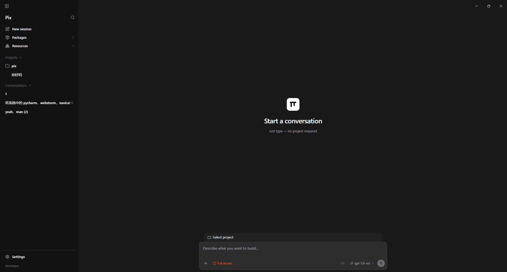
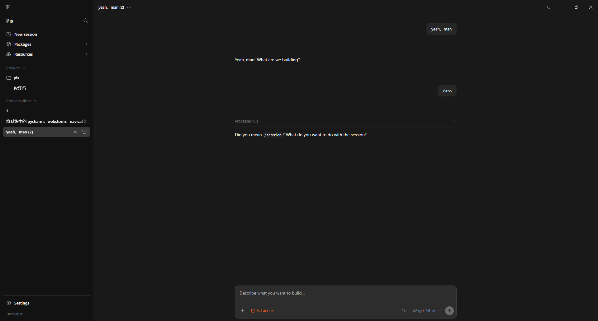
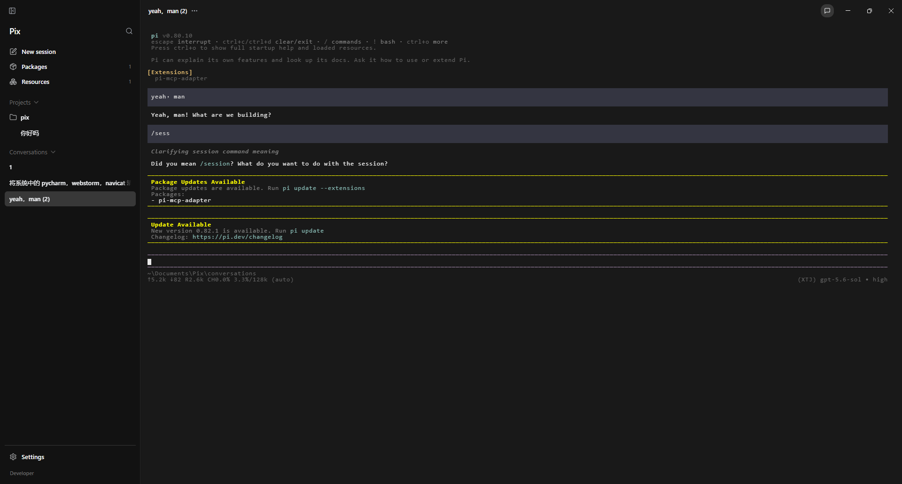

# Pix

Pix is a desktop shell for the [pi](https://pi.dev) coding agent: a Codex-style UI that keeps configuration, packages, sessions, and tools on the native pi side (`~/.pi/agent`).

## Screenshots

Empty conversation — start without a project:



Chat session with sidebar, timeline, and composer:



Embedded pi TUI (terminal mode) for the same session:



## Requirements

- Node.js 22.19 or newer
- pnpm 11.15.1

## Setup

```bash
pnpm install
pnpm electron:install
```

`electron:install` downloads the Electron 43 runtime for your platform.

## Develop

Apps have **independent** `dev` / `build` entry points at the repo root:

| App                          | Dev                | Build                | Notes                                  |
| ---------------------------- | ------------------ | -------------------- | -------------------------------------- |
| **Desktop** (`apps/desktop`) | `pnpm dev:desktop` | `pnpm build:desktop` | `pnpm dev` is an alias for desktop     |
| **Landing** (`apps/landing`) | `pnpm dev:landing` | `pnpm build:landing` | Preview: `pnpm preview:landing`        |
| **All packages**             | —                  | `pnpm build`         | Recursive `build` across the workspace |

### Desktop

```bash
pnpm dev:desktop   # or: pnpm dev
```

Builds renderer / preload / main / agent-host, then launches Electron. Restart after source changes.

Product launch uses your real `HOME` and the same agent dir as the CLI (`~/.pi/agent` / `PI_CODING_AGENT_DIR`). Models, API keys, settings, packages, and tools match interactive `pi`. The last workspace is restored from desktop prefs; no temp workspace is created on every start.

```bash
pnpm build:desktop   # compile only (no Electron launch)
pnpm start:desktop   # launch previously built dist/
```

### Landing page

```bash
pnpm dev:landing      # http://localhost:5174
pnpm build:landing    # static site → apps/landing/dist
pnpm preview:landing  # serve the production build
```

## Validate

```bash
pnpm check        # lint + types + format (same as Ubuntu CI)
pnpm check:types  # lint + types only
pnpm fmt          # auto-fix formatting
pnpm test
pnpm build        # all workspace packages (desktop + landing + libs)
pnpm smoke
pnpm ready        # check + test + build
```

Isolated smoke (temp home + fixture workspace + fake model):

```bash
pnpm smoke
# or
PIX_ISOLATED=1 pnpm start:desktop
```

Packaged smoke (unsigned app directory):

```bash
pnpm package:dir
pnpm smoke:packaged
```

## Package (desktop)

```bash
pnpm package          # alias → package:desktop
pnpm package:desktop  # platform installers (NSIS / DMG / AppImage+deb)
pnpm package:dir      # unpacked app directory only (for local smoke)
```

Installers land under `apps/desktop/release/app/` (unsigned in CI — no code-signing certs yet).

## CI & Release

| Workflow    | File                            | When                      | What                                                                                               |
| ----------- | ------------------------------- | ------------------------- | -------------------------------------------------------------------------------------------------- |
| **CI**      | `.github/workflows/ci.yml`      | PR + push to `main`       | Ubuntu: install → lint/types/format → tests → build; Windows: packaged ConPTY smoke only           |
| **Release** | `.github/workflows/release.yml` | push `v*` tag (or manual) | multi-platform installers → **GitHub Release** (Win NSIS, mac DMG arm64+Intel, Linux AppImage+deb) |

### Versioning

Product version lives only in `apps/desktop/package.json` (what electron-builder ships).
Root and `packages/*` stay at `0.0.0` — they are private workspace packages.

```bash
pnpm version:set 0.1.0
```

### Cut a release

```bash
pnpm version:set 0.1.0
git add apps/desktop/package.json
git commit -m "chore: release v0.1.0"
git tag v0.1.0
git push origin main --tags
```

Tag must match desktop version (`v` + semver). That builds unsigned installers (Windows NSIS `.exe`, macOS `.dmg` + `.zip` for arm64 + Intel, Linux `.AppImage` + `.deb`) plus electron-updater metadata (`latest.yml` / `latest-mac.yml` / `latest-linux.yml` and blockmaps), and publishes them on the GitHub Release. Packaged apps check GitHub Releases once on launch (sidebar shows download / restart when an update is ready). Manual **workflow_dispatch** only uploads Actions artifacts (no Release). Daily CI is Ubuntu-only for lint/types/tests/build, plus a narrow Windows packaged ConPTY smoke; multi-OS packaging stays on Release. Packaging sets `CSC_IDENTITY_AUTO_DISCOVERY=false` (unsigned).

> **macOS note:** auto-update works best with a signed/notarized app. Unsigned builds may fail code-signature verification when installing updates; Windows NSIS and Linux AppImage are the more reliable unsigned paths today.

## Architecture

```text
React Renderer → Preload → Electron Main → utilityProcess Agent Host → pi SDK
```

- Renderer has no Node.js access.
- Main supervises the Agent Host but does not execute pi tools or extensions.
- Agent Host uses the public `@earendil-works/pi-coding-agent` SDK.
- Electron `userData` is only for desktop chrome prefs — never a second agent config layer.
- A fresh pi home receives no Pix packages, resources, or custom settings.
- `utilityProcess` provides crash isolation, not a security sandbox.

## License

See [LICENSE](./LICENSE).

## Community Outreach

[LinuxDo](https://linux.do)
